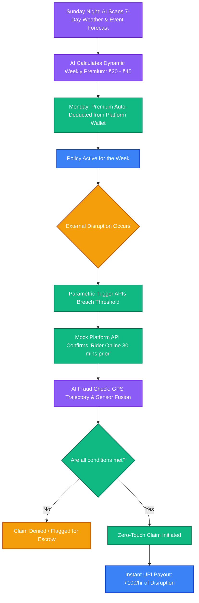
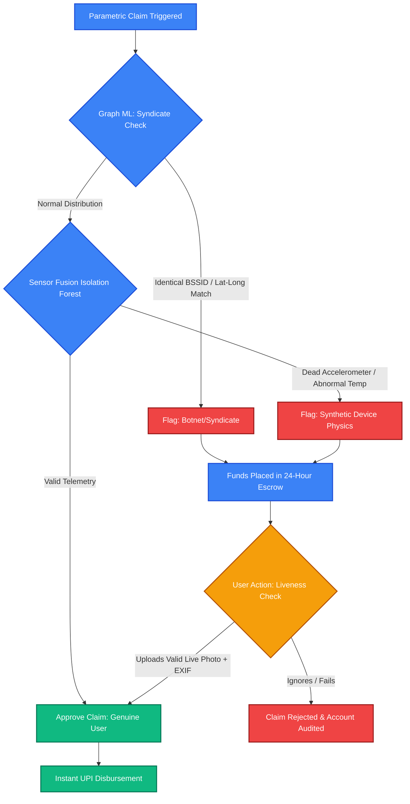

# ⚡ Q-Sure: AI-Powered Income Assurance for India's Gig Economy

**Guidewire DEVTrails 2026 - Phase 1 Submission**  
**Theme:** Ideate & Know Your Delivery Worker  
**Team Name:** The Damned

---

## 🎯 1. The Problem & Persona Focus

**The Persona:** Q-Commerce / 10-Minute Grocery Delivery Partners (e.g., Zepto, Blinkit, Swiggy Instamart).  

**The Core Vulnerability:** 
India's platform-based Q-Commerce workers operate under extreme micro-radius constraints (2–3 km) and rely heavily on daily order streaks for a living wage. Unlike standard e-commerce delivery drivers (Amazon/Flipkart) who have 12-hour delivery windows and can reroute around a flooded street, a Q-Commerce rider is completely paralyzed by localized disruptions. 

A sudden 2-hour torrential downpour, an unplanned political Bandh (curfew), or a VVIP gridlock forces the local "Dark Store" to pause operations. When this happens, the rider's daily incentive streak is destroyed. They absorb 100% of this financial shock with zero safety net. 

**Our Solution:** **Q-Sure** is a zero-touch, AI-enabled parametric insurance platform that guarantees hourly wage payouts when hyper-local external disruptions halt deliveries. 

> ⚠️ **Golden Rule Compliance:** Q-Sure strictly provides a safety net for **LOSS OF INCOME ONLY**. It explicitly excludes features for vehicle repairs, health insurance, or accident medical bills.

---

## 🚴 2. Persona-Based Scenario: The Q-Sure Workflow

**Meet Ramesh (Q-Commerce Rider in Koramangala, Bengaluru):**
1. **Onboarding:** Ramesh links his platform ID. The AI profiles his specific 3km operating zone.
2. **Weekly Coverage:** Based on next week's forecast, his dynamic premium is set at **₹35/week**. This is seamlessly auto-deducted from his platform wallet on Monday.
3. **The Disruption:** On Wednesday at 4:00 PM, an unplanned local political strike (*Bandh*) forces shops to close. The Dark Store pauses operations. Ramesh is stranded.
4. **Parametric Automation (Zero-Touch Claim):** Q-Sure's backend monitors NLP News Scrapers and Traffic APIs, detects the localized Bandh, verifies the Dark Store is offline, and initiates an automatic claim.
5. **Instant Payout:** Ramesh receives a mobile push notification: *"Local Zone Lockdown Detected. ₹200 credited to your UPI for 2 lost hours."* He never filed a manual claim, submitted a photo, or talked to an agent.

---

## 💸 3. The Financial Architecture (Weekly Premium Model)

Gig workers live week-to-week; annual or monthly premiums are financially unviable. Q-Sure operates on a **Dynamic Weekly Micro-Premium Model** structured precisely around the standard gig payout cycle (typically Mondays/Tuesdays).

* **The AI Pricing Engine:** Base premium is ₹20/week. An AI model recalculates the risk every Sunday night. If the 7-day forecast predicts heavy monsoon showers or scheduled VVIP rallies in the rider's zone, the premium dynamically adjusts (e.g., up to ₹45/week).
* **Hourly Wage Replacement:** We do not pay arbitrary lump sums. Q-Sure pays a survival baseline of **₹100 for every hour** of verified disruption.
* **Liquidity Protection:** Payouts are capped at ₹300/day or ₹1,000/week to protect the insurer from catastrophic, city-wide, week-long shutdowns (which classify as government emergencies, not micro-insurance events).

### 🏗️ Q-Sure Financial & Workflow Architecture

## ⚡ 4. The 4 Parametric Triggers (Real-Time Monitoring)

Unlike standard insurance, Q-Sure eliminates manual claim adjusters. We use **Multi-API Consensus** to trigger zero-touch automated payouts. We have identified 4 India-specific micro-disruptions that paralyze Q-Commerce:

1. **Environmental: Flash Floods & Waterlogging**
   * *The Reality:* Indian cities flood fast. Bikes stall; underpasses become unnavigable.
   * *Trigger Logic:* `IF` OpenWeather API (`Rainfall > 15mm/hr`) `AND` Mock Traffic API (`Avg Speed < 8 km/h` in a 3km radius).

2. **Environmental: Extreme Heatwaves (IMD Red Alerts)**
   * *The Reality:* Riding in 43°C heat causes heatstroke. Platforms often algorithmically limit delivery radii or mandate breaks during peak afternoon hours, causing riders to lose prime earning incentives.
   * *Trigger Logic:* `IF` Weather API (`Temp > 42°C` sustained between 1 PM and 4 PM) `AND` Platform API (`Rider Status == Forced Break`).

3. **Social: Unplanned Curfews & Strikes (Bandhs)**
   * *The Reality:* Sudden political strikes or Section 144 orders force local markets to shut down instantly, leaving gig workers stranded with no warning.
   * *Trigger Logic:* `IF` NLP News Scraper detects high volume of "Bandh/Strike" alerts in the local PIN code `AND` Platform API confirms the local Dark Store is offline.

4. **Infrastructure: VVIP Movements & Micro-Gridlocks (Our Innovation)**
   * *The Reality:* A political rally or VVIP convoy can barricade a 2km radius. A Q-Commerce rider is trapped and cannot complete their 10-minute SLAs.
   * *Trigger Logic:* `IF` Traffic API shows a "Black Route" (`Speed < 2 km/h` or complete standstill for > 45 continuous minutes) `AND` Rider GPS confirms they are inside the gridlocked polygon.

---

## 💻 5. Platform Choice & Architecture Justification

Q-Sure utilizes a **Hybrid Platform Architecture** tailored precisely to the two different user personas:

### A. The Rider Platform: Progressive Web App (PWA) / Mobile-First
Gig workers manage their entire livelihood via smartphones mounted on their bikes. For the hackathon prototype, we are building a **PWA (Installable Web App)**. 
* **Justification:** It provides zero-friction onboarding (no app store downloads) and a native-like mobile experience. *Note: While the prototype is a PWA, the production architecture would utilize React Native to access deep background OS sensors for fraud detection.*

### B. The Insurer Platform: Desktop Web Dashboard
Insurance underwriters and platform admins require complex data visualization.
* **Justification:** A Desktop Web Dashboard (built with Next.js & Tailwind) provides the necessary screen real estate to monitor live geospatial city heatmaps, analyze Graph ML fraud networks, and track the financial "Loss Ratio" (Premiums Collected vs. Hourly Payouts Disbursed).

---

## 🚨 6. Adversarial Defense & Anti-Spoofing Strategy
*(Response to the Phase 1 Syndicate Crisis Injection)*

Basic GPS distance checks are officially obsolete. Sophisticated syndicates use GPS spoofers before logging in to mimic stranded riders. To protect Q-Sure's liquidity pool, we have designed a **4-Layer Defense Architecture**:

### Layer 1: Sensor Fusion (Device Physics)
A genuinely stranded delivery partner interacts with their physical environment. Our AI uses an **Isolation Forest** model to analyze device telemetry. If a rider claims to be in a flooded underpass but their device's Barometer reads an altitude of 45 meters (a 12th-floor apartment), or their Z-axis accelerometer is dead-flat (sitting on a table), the claim is flagged as synthetic.

### Layer 2: Graph ML (Syndicate Detection)
To catch coordinated Telegram syndicates, we map real-time claims as a network graph. If 50 riders suddenly trigger payouts from the *exact same 6-decimal lat/long coordinate*, or if multiple claims share the exact same Wi-Fi BSSID, the AI detects a botnet cluster and freezes the zone's automated payouts.

### Layer 3: Active Duty & Trajectory Validation
To receive a payout, the mock Platform API must confirm the rider was "Online" *30 minutes before* the disruption started (preventing opportunistic logins). If they entered the zone just as the rain started, the AI validates their GPS breadcrumbs to ensure a continuous, realistic physical trajectory.

### Layer 4: UX Balance (The Escrow System)
Heavy rain causes genuine network drops. We do not blindly ban users for scrambled GPS data. Flagged claims enter a **24-Hour Escrow State**. The app notifies the rider amicably: *"Network instability detected. Your ₹200 payout is secured in Escrow."* If they need instant funds, they can trigger a "Liveness Check" (uploading a live photo of the flood/barricade). The image EXIF metadata overrides the AI flag and releases the funds.

### 🧠 Anti-Spoofing AI Architecture Diagram

## 🛠️ 7. Tech Stack & Development Plan

* **Frontend (Rider & Admin):** Next.js (React), TailwindCSS, PWA configuration.
* **Backend & MLOps:** Python (FastAPI) - Chosen for seamless integration with Scikit-learn and LightGBM models.
* **Database:** PostgreSQL with PostGIS (for geospatial zone tracking).
* **Integrations:** OpenWeather API, Mocked Traffic & Platform APIs, Razorpay Sandbox (Simulated Instant UPI Payouts).

---

## 🗓️ 8. The 6-Week Development Roadmap

**Phase 1: Ideation & Foundation (Weeks 1-2) 📍 [CURRENT]**
* Lock in the Q-Commerce persona and define the micro-radius vulnerability.
* Design the Weekly Premium mathematical model (Risk vs. Payout).
* Architect the Anti-Spoofing Sensor Fusion framework to neutralize syndicate attacks.
* Build high-fidelity Figma UI mockups for the minimal scope prototype.

**Phase 2: Automation & Protection (Weeks 3-4)**
* Develop the Python FastAPI backend and connect OpenWeather/Traffic mock APIs.
* Build the core zero-touch parametric trigger logic.
* Train the baseline LightGBM model for Dynamic Weekly Pricing using synthetic local weather datasets.
* Build the Next.js Insurer map dashboard to visualize API trigger thresholds.

**Phase 3: Scale & Optimise (Weeks 5-6)**
* Finalize the Advanced Fraud Detection (Isolation Forest) script for GPS spoofing.
* Integrate Razorpay Sandbox to demonstrate the instant automated UPI payout.
* Compile the final analytics dashboard showing Loss Ratios and active policy coverage.
* Record the final 5-minute screen-capture video demonstrating a simulated flash flood triggering a zero-touch payout.

---

## 🔗 9. Phase 1 Deliverables

* **🎥 2-Minute Prototype & Strategy Video:**[Insert your YouTube/Drive Link Here]
* **🎨 UI/UX Figma Mockups:** [Insert your Figma Link Here]

***

> *"Protecting the backbone of India's fast-paced digital economy, one micro-premium at a time."*
